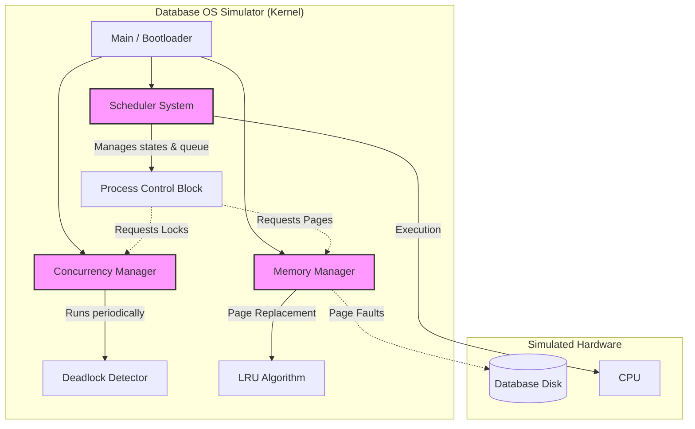
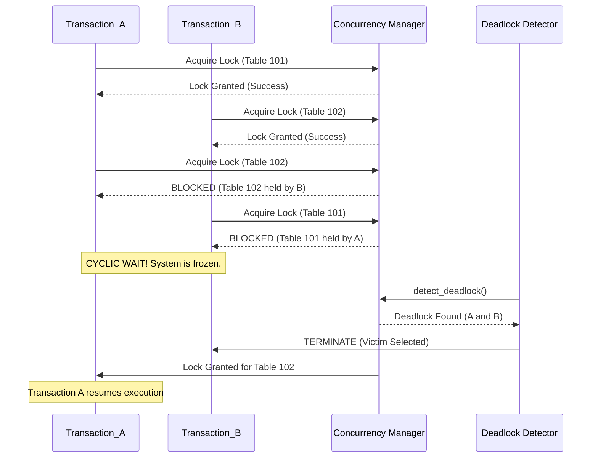

# Database Server OS Simulator (CSE322 Project)

This project is a mini operating system simulator built in C++ specifically designed around a **Database Server Architecture**. It demonstrates core OS concepts such as process scheduling, concurrency control, memory management, and failure recovery under heavy load.

## Theme & Engineering Challenges
Unlike general-purpose operating systems, database servers face unique stresses. This simulator focuses on:
- **Deadlock Detection & Resolution:** Resolving cyclic wait scenarios when multiple transactions attempt to lock the same database tables in reverse order.
- **Memory Exhaustion Handling:** Simulating Page Faults and implementing an Enhanced **LRU (Least Recently Used)** page replacement algorithm over a baseline FIFO approach to keep the DB server alive under heavy memory pressure.

## Core Subsystems Implemented
1. **Process Management:** 5-State Process model (NEW, READY, RUNNING, BLOCKED, TERMINATED) with a baseline FIFO Scheduler.
2. **Concurrency Manager:** Hardware-level locking simulation preventing race conditions on shared database tables.
3. **Memory Manager:** Simulates RAM constraints. Handles Page Hits, Page Faults, and Disk I/O swapping via LRU eviction.

## How to Build & Run
This project uses `CMake` for cross-platform compilation.

```bash
mkdir build
cd build
cmake ..
cmake --build .
./Debug/db-os-simulator.exe  # On Windows
# ./os_sim                   # On Linux/Mac
```

## System Architecture
*This diagram illustrates how the core OS subsystems interact with the simulated hardware and each other.*



## Sequence Diagram: Deadlock Detection & Recovery
*This diagram demonstrates the cross-component interaction during our Engineering Challenge: A cyclic wait condition resolved by the OS kernel.*

