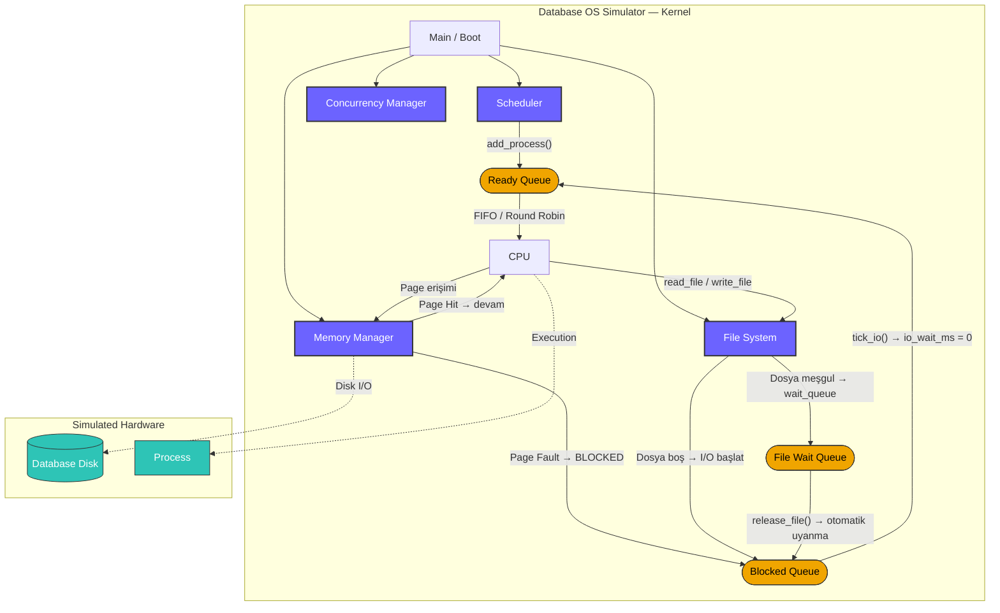
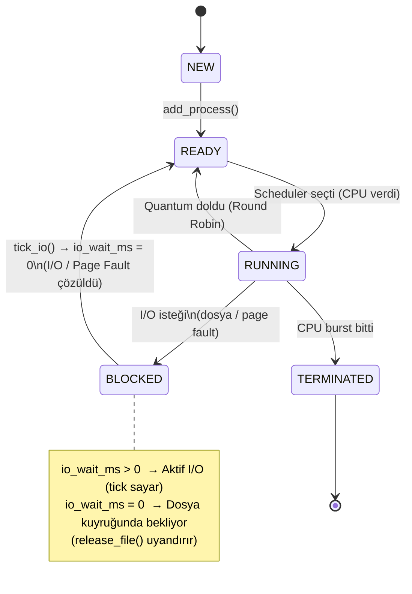
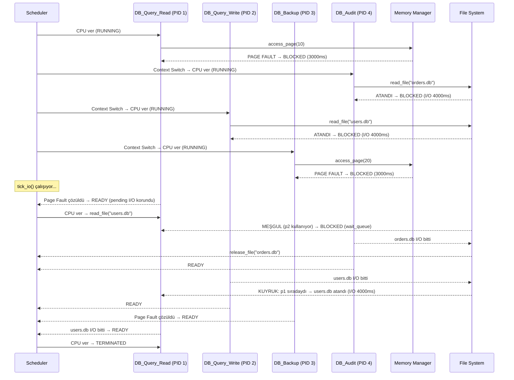
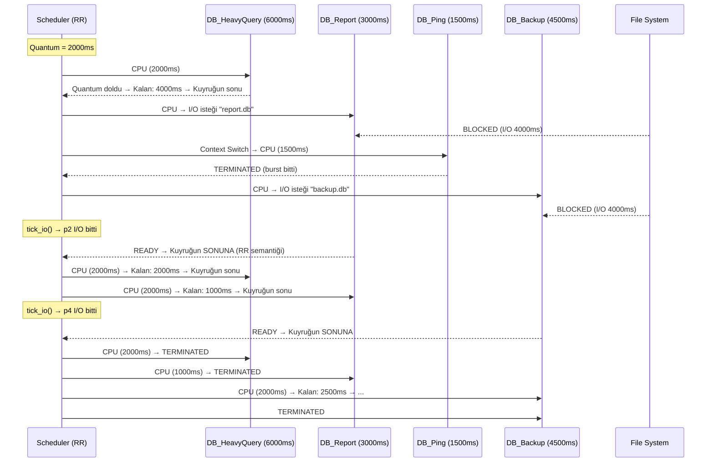
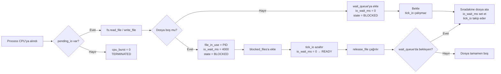
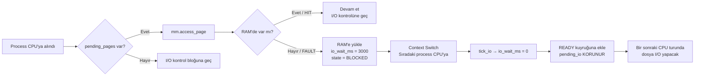

# Database Server OS Simulator

C++ ile geliştirilmiş, **veritabanı sunucusu** mimarisini temel alan bir işletim sistemi simülatörü. Süreç zamanlama, bellek yönetimi, I/O bloklama ve dosya çakışma senaryolarını uçtan uca simüle eder.

---

## Özellikler

| Modül | Detay |
|---|---|
| **Süreç Yönetimi** | 5-State Model (NEW → READY → RUNNING → BLOCKED → TERMINATED) |
| **FIFO Scheduler** | I/O-Aware, dosya çakışması ve Page Fault desteği |
| **Round Robin Scheduler** | Quantum tabanlı preemptive, I/O-Aware |
| **Bellek Yönetimi** | LRU Page Replacement, Page Fault → Process BLOCKED |
| **Dosya Sistemi** | Bekleme kuyruğu (wait queue), dosya çakışması, otomatik uyanma |
| **Concurrency** | Deadlock tespiti ve çözümü |

---

## Proje Yapısı

```
db-os-simulator/
├── include/
│   ├── process.h        # Process struct, 5-State Model, tick_io()
│   ├── scheduler.h      # Scheduler sınıfı (FIFO + Round Robin)
│   ├── filesystem.h     # FileSystem + IOWaitEntry + wait_queue
│   ├── memory.h         # MemoryManager, LRU, PAGE_FAULT_IO_MS
│   └── concurrency.h    # Deadlock Detection
├── src/
│   ├── scheduler.cpp    # run_with_io() + run_round_robin()
│   ├── filesystem.cpp   # read_file / write_file / release_file
│   ├── memory.cpp       # access_page() — Page Fault bloklama
│   ├── concurrency.cpp  # Deadlock algoritması
│   ├── scenario_fifo.cpp  ← Senaryo 1: FIFO çalıştırılabilir
│   └── scenario_rr.cpp    ← Senaryo 2: Round Robin çalıştırılabilir
└── CMakeLists.txt
```

---

## Derleme ve Çalıştırma

```bash
# Proje dizininde:
cmake -B build -S .
cmake --build build

# Senaryo 1: FIFO + Page Fault + Dosya Çakışması
.\build\Debug\scenario_fifo.exe

# Senaryo 2: Round Robin + I/O Blocking
.\build\Debug\scenario_rr.exe
```

---

## Sistem Mimarisi



---

## Process Durum Makinesi (5-State Model)



---

## Senaryo 1: FIFO + Page Fault + Dosya Çakışması

**Gösterilen kavramlar:**
- Page Fault → Process BLOCKED (CPU boş kalmaz, sıradaki çalışır)
- Page Fault çözüldüğünde → Process READY (pending I/O korunur)
- Aynı dosyaya eş zamanlı erişim → dosya kuyruğu (wait_queue)
- `release_file()` → kuyruktaki process otomatik I/O'ya başlar



---

## Senaryo 2: Round Robin + I/O Blocking

**Gösterilen kavramlar:**
- Quantum tabanlı CPU paylaşımı (preemptive)
- Quantum dolunca process kuyruğun sonuna gider
- I/O isteği → BLOCKED, CPU hemen sıradakine geçer
- I/O biten process kuyruğun **sonuna** eklenir (FIFO'dan farkı)



---

## I/O Bloklama Mantığı

### Dosya Meşgul → Bekleme Kuyruğu



### Page Fault → Process Bloklama



---

## Temel Bileşenler

### `Process` (process.h)

```cpp
struct Process {
    int          process_id;
    std::string  name;
    int          priority;
    int          cpu_burst_time;
    int          io_wait_ms;     // > 0: aktif I/O  | = 0: dosya kuyruğunda
    ProcessState state;          // NEW/READY/RUNNING/BLOCKED/TERMINATED

    void tick_io(int elapsed_ms);  // io_wait_ms azalt; 0'a düşünce READY
};
```

### `FileSystem` (filesystem.h)

```cpp
class FileSystem {
    map<string, int>              file_in_use;   // filename → sahip PID
    map<string, queue<IOWaitEntry>> wait_queues; // filename → bekleyen processler

    void    read_file(Process* p, const string& filename);
    void    write_file(Process* p, const string& filename);
    Process* release_file(const string& filename); // → kuyruktaki process döner
};
```

### `MemoryManager` (memory.h)

```cpp
class MemoryManager {
    // Page Hit  → true  (process etkilenmez)
    // Page Fault→ false (process BLOCKED, io_wait_ms = PAGE_FAULT_IO_MS)
    bool access_page(int page_id, Process* p = nullptr);
    void evict_page(); // LRU: en eski sayfayı RAM'den çıkar
};
```

### `Scheduler` (scheduler.h)

```cpp
class Scheduler {
    void run_with_io(FileSystem& fs,
                     const map<int,string>& io_requests,
                     int tick_ms = 500,
                     MemoryManager* mm = nullptr,
                     const map<int,int>& page_requests = {});

    void run_round_robin(FileSystem& fs,
                         const map<int,string>& io_requests,
                         int quantum_ms = 2000,
                         int tick_ms = 500,
                         MemoryManager* mm = nullptr,
                         const map<int,int>& page_requests = {});
};
```

---

## FIFO vs Round Robin Karşılaştırması

| Özellik | FIFO (I/O-Aware) | Round Robin |
|---|---|---|
| CPU verme şekli | Burst tamamen biter | Quantum kadar verilir |
| Preemption | Sadece I/O'da | Quantum + I/O'da |
| I/O sonrası pozisyon | Kuyruğun önü | Kuyruğun **sonu** |
| Starvation riski | Uzun process öncelik alabilir | Tüm processler eşit pay alır |
| Page Fault | ✅ BLOCKED → READY | ✅ BLOCKED → READY (kuyruk sonu) |
| Dosya çakışması | ✅ wait_queue | ✅ wait_queue |

---

## Kullanılan OS Kavramları

- **5-State Process Model** — NEW, READY, RUNNING, BLOCKED, TERMINATED
- **Context Switch** — I/O / Page Fault / Quantum dolduğunda CPU'nun el değiştirmesi
- **I/O-Aware Scheduling** — CPU, I/O bekleyen süreçlerde boş kalmaz
- **Page Fault Handling** — Disk I/O simülasyonu, process bloklama ve uyanma
- **File Locking & Wait Queue** — Dosya bazlı kilitleme, FIFO bekleme kuyruğu
- **LRU Page Replacement** — En az kullanılan sayfayı RAM'den çıkar
- **Deadlock Detection** — Döngüsel bekleme tespiti ve victim seçimi
- **Tick-Based Simulation** — `tick_io()` ile gerçek thread uyutmadan süre simülasyonu